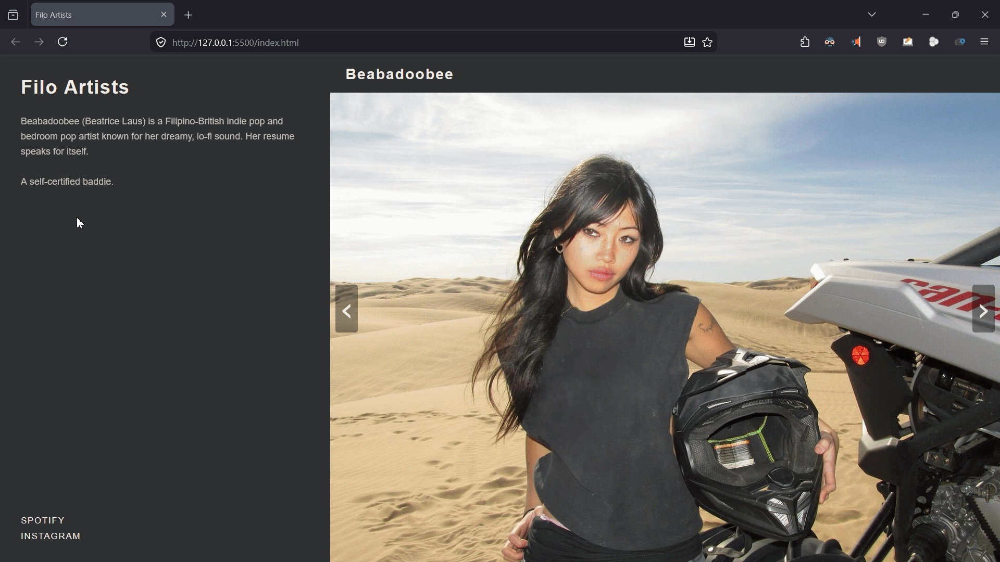

# Filo Artists

> A curated gallery of celebrated, venerated, as well as young and up and coming Filipino musical artists.



---

## 📍 About

**Filo Artists** is an interactive web app showcasing 12 talented Filipino-American musicians across genres like indie pop, R&B, and bedroom pop. Browse each artist's biography and jump directly to their Spotify, Instagram, or TikTok profile; all from one clean, dark-themed page.

This project was built as a personal passion project and submitted as part of my application to the **Snap Engineering Academy (SEA)**.

---

## 📖 Background

Filipino-American artists are some of the most exciting voices in independent music today, yet they often fly under the radar. This project was born out of a desire to spotlight 12 artists I personally love and make their music more discoverable.

Beyond the personal motivation, **Filo Artists** was developed to demonstrate core frontend fundamentals: clean HTML structure, responsive CSS layout, and lightweight JavaScript DOM manipulation; all without relying on any external libraries or frameworks.

---

## 🌟 Features

- **Artist Carousel** — Navigate through 12 artists using left/right arrow buttons
- **Dual-Panel Layout** — Artist biography and social links on the left; artist photo card on the right
- **Seamless Wrap-Around** — Navigation loops from the last artist back to the first (and vice versa)
- **Social Links** — Direct links to each artist's Spotify, Instagram, and TikTok profiles
- **Dark Theme** — Minimal, high-contrast UI with a dark gray and cream color palette

---

## 🛠️ Tech Stack

| Technology | Purpose |
|---|---|
| HTML5 | Page structure, artist cards, and biography content |
| CSS3 | Flexbox layout, dark theme, visibility toggling |
| Vanilla JavaScript | Carousel navigation logic, DOM manipulation |

No build tools, no frameworks, no dependencies.

---

## 📂 Project Structure

```
filo-artists/
├── index.html       # Main page — all 12 artist cards and bios
├── style.css        # Styling (dark theme, flexbox layout, active-class visibility)
├── scripts.js       # Carousel navigation logic (11 lines)
├── pics/            # Artist photo assets (12 images)
└── docs/            # Wireframes and design reference images
    ├── P2-wireframe.drawio
    ├── P2-wireframe.png
    └── example-landing-page.png
```

---

## 🚀 Local Setup & Installation

No installation or build process required. This is a fully static site.

**Option 1 — Open directly in browser:**
```bash
# Clone the repo
git clone https://github.com/jSwAggy01/filo-artists.git
cd filo-artists

# Open index.html in your default browser
open index.html        # macOS
start index.html       # Windows
xdg-open index.html    # Linux
```

**Option 2 — Serve with a local HTTP server:**
```bash
# Using Python
python -m http.server 8000

# Using Node.js
npx http-server
```
Then navigate to `http://localhost:8000` in your browser.

---

## 🔮 Future Improvements

- [ ] Deploy to **GitHub Pages**
- [ ] Search / filter artists by genre
- [ ] Embedded **Spotify** music previews via iframe
- [ ] Fully **responsive/mobile** layout
- [ ] Smooth **CSS transition animations** between card switches
